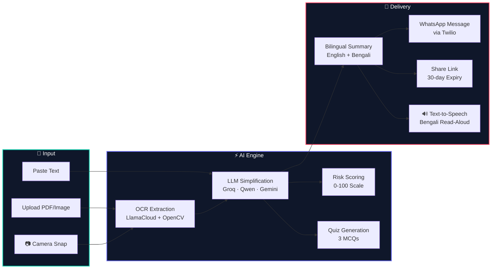
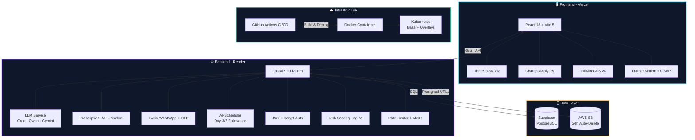
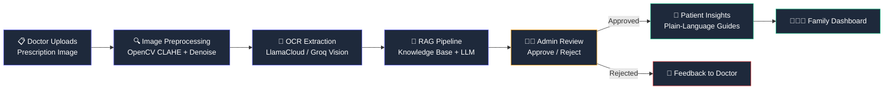
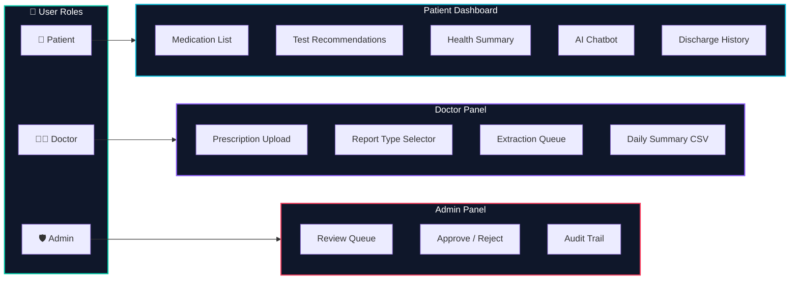
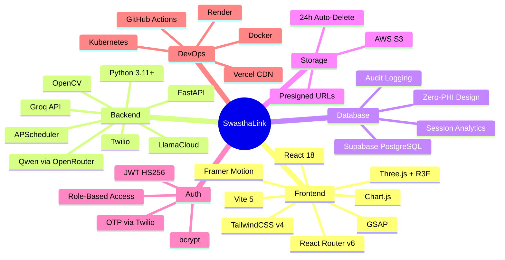
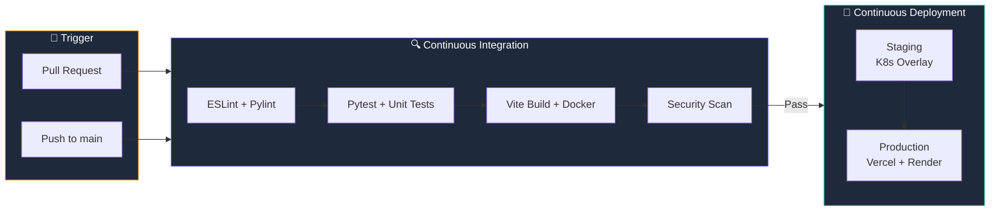
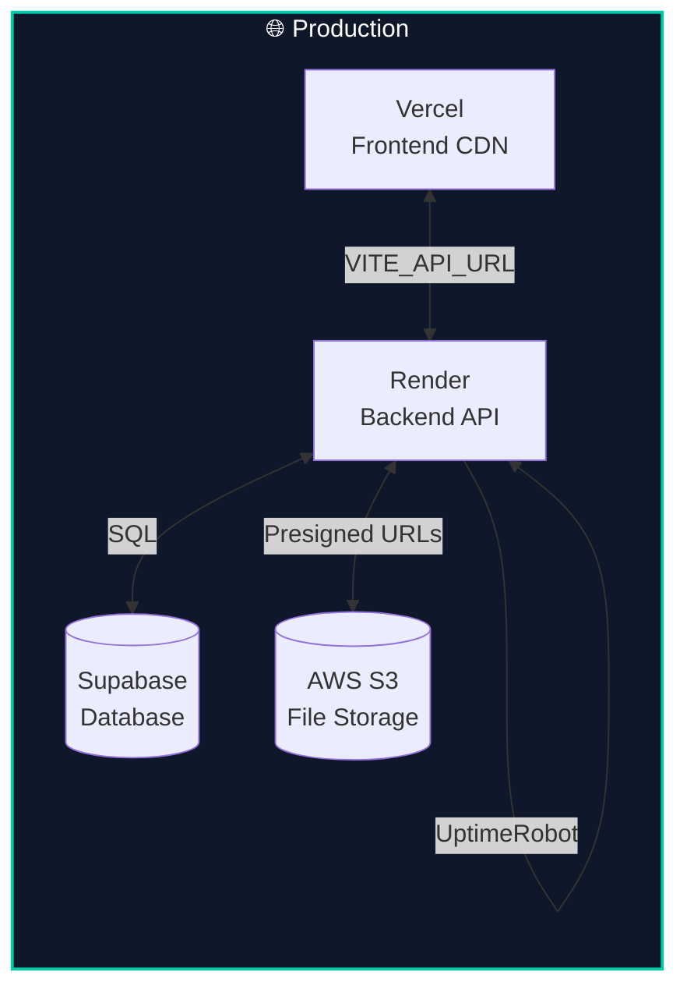

<p align="center">
  
</p>

<h1 align="center">
  <br/>
  🏥 SwasthaLink
  <br/>
</h1>

<h3 align="center">
  <em>AI-Powered Medical Discharge Simplification — Bridging the Gap Between Clinical Jargon and Patient Understanding</em>
</h3>

<p align="center">
  <a href="#-quickstart"></a>
  <a href="#-live-demo"></a>
  <a href="#-api-surface"></a>
  <a href="LICENSE"></a>
</p>

<p align="center">
  
  
  
  
  
  
  
  
</p>

---

<br/>

## The Problem

> **40–80% of patients don't understand their hospital discharge instructions.**

This isn't a minor inconvenience — it's a **$26B+ annual crisis** in preventable readmissions.

| Pain Point | Real-World Impact |
|:---|:---|
| 🧬 **Medical jargon** in discharge papers | Patients misunderstand dosages, skip critical medications |
| 🌐 **Language barrier** — summaries in English, patients speak Bengali/Hindi | Caregivers can't translate nuanced medical instructions |
| 📉 **Zero comprehension verification** | Hospitals discharge patients hoping they "got it" |
| 📵 **No accessible follow-up** | Paper instructions get lost; no digital reinforcement |

**SwasthaLink eliminates this gap** — turning dense clinical documents into plain-language, bilingual, WhatsApp-delivered summaries that patients *actually understand*.

---

## How It Works



---

## Product Strengths

<table>
<tr>
<td width="50%">

### 🧠 Multi-Model LLM Intelligence
```
Primary   → Groq (llama-3.3-70b)
Fallback  → Groq (llama-3.1-8b)
Secondary → Qwen3.6+ (OpenRouter)
Vision    → Groq (llama-4-scout-17b)
```
**Automatic failover** ensures 99.9% uptime — if one model is down, the next picks up seamlessly.

</td>
<td width="50%">

### 🔒 Zero-PHI Architecture
```
Clinical Text → RAM Only → LLM API → RAM → Client
                 ↑ Never touches disk or DB

Database stores: session_id, role, timestamp, score
         NEVER : patient names, clinical text, PHI
```
**HIPAA-mindful by design** — no patient data is ever persisted.

</td>
</tr>
<tr>
<td>

### 🌍 True Bilingual Intelligence
Not machine translation — the LLM generates **native Bengali** using everyday conversational language a grandmother would understand. Role-adapted for:
- **Patient** → Simple, reassuring
- **Caregiver** → Actionable, detailed
- **Elderly** → Extra gentle, large context

</td>
<td>

### 📊 Adaptive Comprehension Loop
```
Quiz Score ≥ 2/3 → ✅ Patient understands
Quiz Score < 2/3 → 🔄 Ultra-simple re-explanation
                    ↳ Triggered automatically
```
**Industry-first**: Real-time reading-comprehension verification with fallback simplification.

</td>
</tr>
</table>

---

## Platform Architecture



---

## Feature Matrix

### Core Intelligence

| Feature | Description | Tech |
|:---|:---|:---|
| **AI Simplification** | Clinical jargon → plain language in seconds | Groq LLM (70B) |
| **Bilingual Output** | Native English + Bengali (not translated) | LLM prompt engineering |
| **OCR Pipeline** | PDF, image, camera → extracted text | LlamaCloud + OpenCV CLAHE |
| **Risk Scoring** | 0–100 readmission risk with visual gauge | Multi-factor algorithm |
| **Comprehension Quiz** | 3 MCQs + auto re-explanation on failure | LLM-generated |
| **Drug Interactions** | Pairwise medication safety analysis | LLM + knowledge base |

### Prescription RAG Pipeline



### Delivery & Engagement

| Feature | Description |
|:---|:---|
| **WhatsApp Delivery** | One-tap send via Twilio — reach patients where they are |
| **Day-3 / Day-7 Follow-ups** | Automated nudge messages via APScheduler |
| **Share Links** | Token-based 30-day links for caregivers (no login needed) |
| **Text-to-Speech** | Bengali read-aloud via Web Speech API |
| **QR Code Sharing** | Scannable codes for instant caregiver access |

### Role-Based Dashboards



### 3D Visualizations & Analytics

| Component | Description |
|:---|:---|
| 🫀 **Pulsating Heart** | BPM-synced 3D heartbeat (Three.js + React Three Fiber) |
| 🧬 **DNA Double Helix** | Animated base pairs with emissive lighting |
| 🧊 **Floating Medical Cube** | Metric overlay with auto-rotation |
| 📈 **Vital Signs Chart** | Multi-line heart rate + BP over time |
| 📊 **Comprehension Score** | Bar chart with benchmark overlay |
| 🍩 **Processing Status** | Doughnut chart (completed/processing/pending/failed) |
| 📉 **Readmission Risk** | Line chart vs industry average |
| 🎯 **Risk Gauge** | SVG 0–100 with green/yellow/red zones |

---

## Tech Stack Deep Dive



---

## CI/CD Pipeline



| Layer | Tool | Purpose |
|:---|:---|:---|
| CI Entrypoint | `.github/workflows/ci.yml` | Triggers on PR/push |
| Reusable CI | `.github/workflows/ci-reusable.yml` | Lint, test, build |
| CD Pipeline | `.github/workflows/cd.yml` | Deploy to staging/production |
| Containers | `Dockerfile.frontend` + `backend/Dockerfile` | Reproducible builds |
| Orchestration | `infra/k8s/base/` + `overlays/` | Kubernetes manifests |

---

## API Surface

> Full interactive docs available at **`/docs`** (Swagger UI) when the backend is running.

<details>
<summary><b>📋 Complete Endpoint Map (click to expand)</b></summary>

### Health & Root
| Method | Endpoint | Auth | Description |
|:---|:---|:---|:---|
| `GET` | `/` | — | API info + version |
| `GET` | `/api/health` | — | Health check (LLM, Twilio, Supabase, S3) |

### Authentication
| Method | Endpoint | Auth | Description |
|:---|:---|:---|:---|
| `POST` | `/api/auth/login` | — | Login → JWT token |
| `POST` | `/api/auth/signup` | — | Create account |
| `GET` | `/api/auth/me` | JWT | Verify session |
| `POST` | `/api/auth/send-otp` | — | OTP via WhatsApp/SMS |
| `POST` | `/api/auth/verify-otp` | — | Verify OTP code |
| `POST` | `/api/auth/forgot-password` | — | Request reset OTP |
| `POST` | `/api/auth/reset-password` | — | Reset with OTP |

### Discharge Processing
| Method | Endpoint | Auth | Description |
|:---|:---|:---|:---|
| `POST` | `/api/process` | — | Simplify discharge summary |
| `POST` | `/api/quiz/submit` | — | Submit quiz → score + re-explain |
| `POST` | `/api/upload` | — | PDF/image → OCR extraction |
| `GET` | `/api/patient/{id}/history` | — | Discharge history |
| `GET` | `/api/share/{token}` | — | Public caregiver view |

### Prescriptions
| Method | Endpoint | Auth | Description |
|:---|:---|:---|:---|
| `POST` | `/api/prescriptions/extract` | — | Upload + OCR + RAG extract |
| `GET` | `/api/prescriptions/pending` | — | Admin: pending queue |
| `POST` | `/api/prescriptions/{id}/approve` | — | Admin approves → insights |
| `POST` | `/api/prescriptions/{id}/reject` | — | Admin rejects |
| `GET` | `/api/prescriptions/for-patient/{id}` | — | Patient's prescriptions |

### WhatsApp & Delivery
| Method | Endpoint | Auth | Description |
|:---|:---|:---|:---|
| `POST` | `/api/send-whatsapp` | — | Send via Twilio |
| `GET` | `/api/whatsapp/sandbox-instructions` | — | Sandbox join guide |

### Analytics & Utility
| Method | Endpoint | Auth | Description |
|:---|:---|:---|:---|
| `GET` | `/api/analytics` | — | Session statistics |
| `POST` | `/api/drug-interactions` | — | Medication interaction check |
| `GET` | `/api/doctor/daily-summary` | — | Doctor's daily report |

</details>

---

## Quickstart

### Prerequisites

| Tool | Version | Purpose |
|:---|:---|:---|
| Node.js | 18+ | Frontend build |
| Python | 3.11+ | Backend runtime |
| Git | Latest | Version control |

### 1. Clone & Install

```bash
git clone https://github.com/Suvam-paul145/SwasthaLink.git
cd SwasthaLink
```

### 2. Backend

```bash
cd backend
python -m venv venv

# Windows
venv\Scripts\activate
# macOS/Linux
source venv/bin/activate

pip install -r requirements.txt
```

Create `backend/.env`:
```env
GEMINI_API_KEY=your_key_here
GROQ_API_KEY=your_key_here
TWILIO_ACCOUNT_SID=your_sid
TWILIO_AUTH_TOKEN=your_token
TWILIO_WHATSAPP_NUMBER=whatsapp:+14155238886
SUPABASE_URL=https://your-project.supabase.co
SUPABASE_KEY=your_anon_key
AWS_ACCESS_KEY_ID=your_key
AWS_SECRET_ACCESS_KEY=your_secret
AWS_S3_BUCKET=your_bucket
```

```bash
uvicorn main:app --reload --host 0.0.0.0 --port 8000
```

### 3. Frontend

```bash
# From project root (new terminal)
npm install
```

Create `.env`:
```env
VITE_API_URL=http://localhost:8000
```

```bash
npm run dev
```

### 4. Access

| Service | URL |
|:---|:---|
| Frontend | `http://localhost:5173` |
| Backend API | `http://localhost:8000` |
| Swagger Docs | `http://localhost:8000/docs` |
| Health Check | `http://localhost:8000/api/health` |

---

## Docker Deployment

```bash
# Backend
docker build -t swasthalink-backend ./backend
docker run -p 8000:8000 --env-file backend/.env swasthalink-backend

# Frontend
docker build -t swasthalink-frontend -f Dockerfile.frontend .
docker run -p 80:80 swasthalink-frontend
```

### Kubernetes

```bash
# Staging
kubectl apply -k infra/k8s/overlays/staging/

# Production
kubectl apply -k infra/k8s/overlays/production/
```

---

## Production Deployment



| Layer | Platform | Notes |
|:---|:---|:---|
| Frontend | **Vercel** | Auto-deploy from `main`, global CDN |
| Backend | **Render** | Auto-deploy, UptimeRobot for cold-start prevention |
| Database | **Supabase** | Managed PostgreSQL, zero-PHI compliant |
| Storage | **AWS S3** | 24-hour lifecycle auto-delete |

> See [VERCEL_RENDER_DEPLOYMENT_GUIDE.md](VERCEL_RENDER_DEPLOYMENT_GUIDE.md) for step-by-step production setup.

---

## Security Posture

| Layer | Implementation |
|:---|:---|
| **Data Privacy** | Zero-PHI architecture — clinical text never persisted |
| **Authentication** | JWT (HS256, 24h expiry) + bcrypt password hashing |
| **OTP Verification** | Twilio Verify for phone-based identity |
| **File Storage** | S3 with 24-hour auto-delete lifecycle policy |
| **API Security** | Rate limiting + per-key throttling + alert system |
| **CORS** | Strict origin allowlist (`FRONTEND_URL` + `EXTRA_CORS_ORIGINS`) |
| **Secrets** | Environment variables only — no hardcoded credentials |
| **Share Links** | Token-based with 30-day expiry, no auth required |
| **Audit Trail** | Admin actions logged with timestamp, actor, and action |

---

## Performance

| Metric | Value |
|:---|:---|
| Discharge simplification | **< 8 seconds** (end-to-end) |
| OCR extraction | **< 5 seconds** (image → structured text) |
| LLM fallback switch | **< 500ms** (automatic on failure) |
| WhatsApp delivery | **< 3 seconds** (Twilio API) |
| Frontend bundle | **< 400KB** gzipped (Vite tree-shaking) |
| 3D render | **60 FPS** (Three.js with React Three Fiber) |

---

## Project Structure

```
SwasthaLink/
├── src/                              # React Frontend
│   ├── components/                   # UI Components + 3D Visualizations
│   ├── pages/                        # Route Pages (Landing, ClarityHub, Dashboards)
│   ├── services/                     # API Client Layer
│   ├── context/                      # Auth Context (JWT)
│   └── utils/                        # Config, Animations, Chart Themes
├── backend/                          # FastAPI Backend
│   ├── routes/                       # API Route Handlers
│   ├── services/                     # Business Logic + LLM + RAG
│   ├── models/                       # Pydantic Data Models
│   ├── db/                           # Supabase Database Layer
│   ├── auth/                         # JWT + bcrypt Auth
│   ├── ai/                           # LLM Prompt Templates
│   ├── core/                         # Config + Exception Handling
│   └── tests/                        # Pytest Test Suite
├── infra/k8s/                        # Kubernetes Manifests
│   ├── base/                         # Base configs
│   └── overlays/                     # Staging + Production
├── .github/workflows/                # CI/CD Pipelines
├── docs/                             # Architecture Documentation
├── sample_data/                      # Demo Discharge Summaries
├── Dockerfile.frontend               # React → Nginx Container
├── backend/Dockerfile                # FastAPI Container
└── supabase_schema.sql               # Database DDL
```

---

## Testing

```bash
# Backend tests
cd backend
pytest

# Frontend lint
npm run lint

# E2E
python e2e_test.py
```

---

## Roadmap

| Priority | Feature | Status |
|:---|:---|:---|
| 🔥 P0 | Bengali Text-to-Speech Read-Aloud | 🔜 Next |
| 🔥 P0 | Camera Capture (snap discharge paper) | 🔜 Next |
| 🔴 P1 | QR Code Sharing for Caregivers | Planned |
| 🔴 P1 | PWA Offline Support | Planned |
| 🔴 P1 | Multi-Language (Hindi, Tamil, Telugu) | Planned |
| 🟡 P2 | Realtime Doctor Notifications | Planned |
| 🟡 P2 | Emergency Medical QR Card | Planned |
| 🟡 P2 | Speech-to-Text Input | Planned |

> See [ROADMAP.md](ROADMAP.md) for the full feature backlog with implementation details.

---

## Contributing

We welcome contributions! See [CONTRIBUTOR.md](CONTRIBUTOR.md) for guidelines.

```bash
# Fork → Branch → Code → Test → PR
git checkout -b feature/your-feature
# Make changes
cd backend && pytest          # Backend tests pass
npm run lint                  # Frontend lint clean
git commit -m "feat: ..."
git push origin feature/your-feature
# Open PR → CI runs automatically
```

---

## Documentation

| Document | Description |
|:---|:---|
| [ROADMAP.md](ROADMAP.md) | Feature backlog with priorities |
| [COMPONENTS_GUIDE.md](COMPONENTS_GUIDE.md) | 3D & chart component reference |
| [LOCAL_DEV_GUIDE.md](LOCAL_DEV_GUIDE.md) | Local development setup |
| [VERCEL_RENDER_DEPLOYMENT_GUIDE.md](VERCEL_RENDER_DEPLOYMENT_GUIDE.md) | Production deployment |
| [CONTRIBUTOR.md](CONTRIBUTOR.md) | Contribution guidelines |
| [docs/cicd-architecture.md](docs/cicd-architecture.md) | CI/CD pipeline architecture |

---

<p align="center">
  <br/>
  <strong>Built with ❤️ by <a href="https://github.com/Suvam-paul145">Suvam Paul</a> · ownworldmade</strong>
  <br/>
  <sub>SwasthaLink — Because every patient deserves to understand their own health.</sub>
  <br/><br/>
  <a href="LICENSE"></a>
</p>