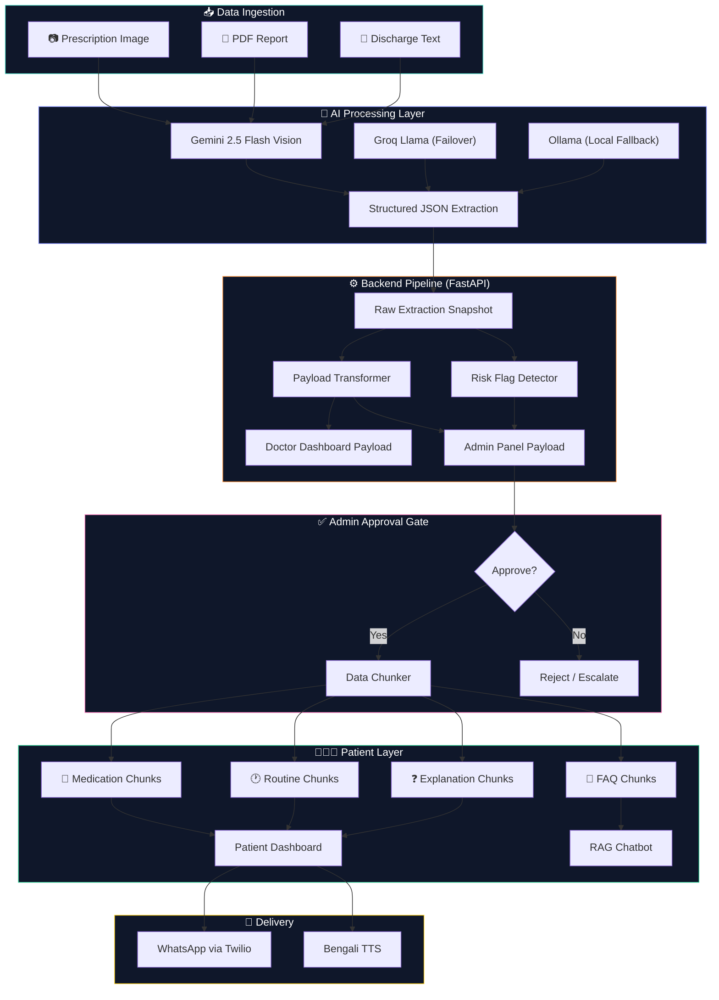
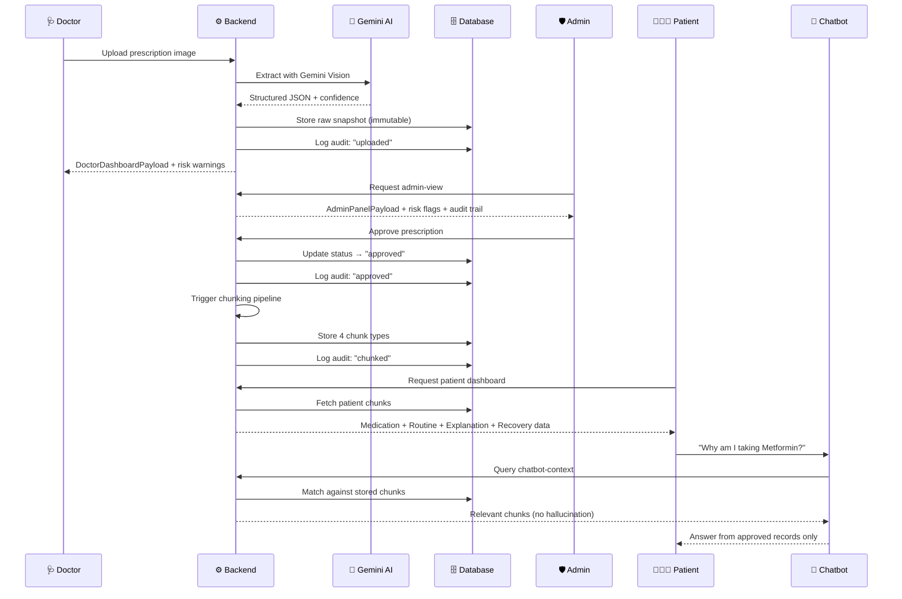

<p align="center">
  
</p>

<h1 align="center">SwasthaLink 🏥</h1>

<p align="center">
  <strong>AI-Powered Clinical Intelligence Platform — Bridging the Gap Between Medical Jargon and Patient Understanding</strong>
</p>

<p align="center">
  
  
  
  
  
  
  
  
</p>

<p align="center">
  <b>Built by:</b> Suvam Paul · <a href="https://github.com/Suvam-paul145">@Suvam-paul145</a> · <b>ownworldmade</b>
</p>

---

## 📖 What is SwasthaLink?

**SwasthaLink** (স্বাস্থ্যলিংক — "Health Link" in Bengali) is a production-grade healthcare AI platform that transforms the way clinical data flows between **Doctors**, **Administrators**, and **Patients**. At its core, it solves a critical healthcare crisis: **40–80% of patients leave hospitals without understanding their discharge instructions**, leading to incorrect medication usage, missed follow-ups, preventable re-admissions, and unnecessary anxiety. SwasthaLink attacks this problem through a structured, three-layer data pipeline that takes raw medical documents (prescriptions, ECGs, MRIs, blood reports), extracts structured clinical data using **Google Gemini 2.5 Flash** vision AI, routes it through a role-based approval workflow with risk detection and audit logging, and ultimately delivers patient-optimized, plain-language health summaries — complete with bilingual output (English + Bengali), medication cards, daily routine guides, comprehension quizzes, WhatsApp delivery, and a RAG-powered chatbot that answers patient queries strictly from their approved medical records, ensuring zero hallucination and complete clinical traceability.

---

## 🎯 The Problem We Solve

<table>
<tr>
<td width="50%">

### ❌ Before SwasthaLink
- Patients receive complex clinical discharge summaries
- Medical jargon creates confusion and anxiety
- Medication errors from misunderstood instructions
- No structured way to access personal health data
- Follow-up appointments frequently missed
- Caregivers left in the dark about treatment plans
- No audit trail for prescription lifecycle
- Re-admission rates spike from poor comprehension

</td>
<td width="50%">

### ✅ After SwasthaLink
- AI converts clinical text to plain everyday language
- Bilingual output (English + Bengali) for accessibility
- Visual medication cards with dosage & timing
- Chunked, searchable personal health dashboard
- Automated follow-up reminders via WhatsApp
- Family caregivers get role-appropriate summaries
- Complete audit trail from upload to delivery
- Comprehension quizzes verify patient understanding

</td>
</tr>
</table>

---

## 👥 Who Benefits? — Platform Beneficiaries

```
┌─────────────────────────────────────────────────────────────────────────────┐
│                        SwasthaLink Beneficiary Map                         │
├──────────────┬──────────────────────────────────────────────────────────────┤
│  🩺 DOCTORS  │  Upload prescriptions & reports → AI extracts structured    │
│              │  clinical data → Review extraction quality → Track patient  │
│              │  pipeline with confidence scores & risk warnings            │
├──────────────┼──────────────────────────────────────────────────────────────┤
│  🛡️ ADMINS   │  Full visibility over all prescriptions → Approve/Reject/      │
│              │  Escalate with audit trail → Risk flag detection →          │
│              │  Raw vs Processed data comparison → Quality assurance       │
├──────────────┼──────────────────────────────────────────────────────────────┤
│  👨‍👩‍👧 PATIENTS │  Plain-language health dashboard → Medication guides with   │
│  & FAMILIES  │  "why am I taking this?" → Daily routine instructions →    │
│              │  Recovery timeline → AI chatbot for instant Q&A →           │
│              │  WhatsApp delivery → Comprehension verification            │
├──────────────┼──────────────────────────────────────────────────────────────┤
│  👴 ELDERLY  │  Extra-simplified explanations → Bengali translations →    │
│              │  Text-to-speech read-aloud → Larger text summaries →       │
│              │  Caregiver-friendly formats                                │
├──────────────┼──────────────────────────────────────────────────────────────┤
│  🏥 HOSPITALS│  Reduced re-admission rates → Better patient compliance →  │
│              │  Complete audit logging → Scalable clinical data pipeline  │
│              │  → AI-powered document processing at scale                │
└──────────────┴──────────────────────────────────────────────────────────────┘
```

### Why Use SwasthaLink?

| User | Pain Point | SwasthaLink Solution |
|------|-----------|---------------------|
| **Doctors** | Manual data entry, illegible prescriptions, no extraction feedback | Upload image → AI extracts → confidence score + risk warnings |
| **Admins** | No visibility into data quality, no approval workflow | Full audit trail, risk flags, raw/processed toggle, approve/reject/escalate |
| **Patients** | Can't understand medical jargon, forget medication schedules | Plain-language dashboard, medication cards, daily routine, chatbot Q&A |
| **Families** | Left out of treatment loop, language barriers | Bilingual summaries, caregiver-optimized views, WhatsApp delivery |
| **Elderly** | Small text, complex terminology, no tech familiarity | Simplified language, Bengali TTS, comprehension quizzes |

---

## ✨ Feature Highlights

### 🤖 AI-Powered Clinical Extraction
- **Gemini 2.5 Flash Vision** — Upload prescription images, PDFs, ECGs, MRIs, blood reports
- **Multi-model failover** — Gemini → Groq → Ollama automatic routing
- **Confidence scoring** — Every extraction rated with quality percentage
- **Risk flag detection** — Auto-warns on missing dosages, low confidence, incomplete data

### 🔐 Role-Based Access Control
- **Doctor Panel** — Upload, extract, review with quality indicators
- **Admin Panel** — Full visibility, approve/reject/escalate, audit trails
- **Patient Dashboard** — Chunked health data, medication guides, recovery timeline
- **Authentication** — JWT-based login/signup with role enforcement

### 💬 RAG-Powered Chatbot
- **Zero-hallucination policy** — Responses strictly from approved medical records
- **Keyword-based relevance scoring** — Matches queries against stored data chunks
- **Pre-built FAQ suggestions** — "Why am I taking this?", "When is my follow-up?"
- **Data traceability** — Every answer links back to an approved prescription

### 🌍 Bilingual & Accessible
- **English + Bengali** output with everyday conversational language
- **Text-to-Speech** — Bengali read-aloud using Web Speech API
- **Comprehension quizzes** — 3 MCQs to verify understanding (auto-retry on failure)
- **WhatsApp delivery** — Send simplified summary to patient's phone via Twilio

### 🎨 Premium Visual Experience
- **Dark-teal glassmorphism** design language across all dashboards
- **3D medical visualizations** — Three.js heart, DNA helix, floating cubes
- **Chart.js analytics** — Vital signs, comprehension scores, risk trends
- **Micro-animations** — Framer Motion + GSAP for premium feel

---

## 🏗️ System Architecture

### High-Level Platform Overview



### Three-Layer Data Architecture

SwasthaLink processes clinical data through **three immutable, auditable layers**:

```mermaid
graph LR
    subgraph L1["🔒 Layer 1 — Raw Extraction"]
        A1["Original OCR/AI text"]
        A2["Raw JSON snapshot"]
        A3["Confidence score"]
        A4["Timestamp + Doctor ID"]
    end

    subgraph L2["🩺 Layer 2 — Clinical Processing"]
        B1["Doctor Dashboard Payload"]
        B2["Admin Panel Payload"]
        B3["Risk Flags + Warnings"]
        B4["Audit Log Entries"]
    end

    subgraph L3["✅ Layer 3 — Patient Optimized"]
        C1["💊 Medication Chunks"]
        C2["🕐 Routine Chunks"]
        C3["❓ Explanation Chunks"]
        C4["💬 FAQ Chunks"]
    end

    L1 -->|"Transform"| L2
    L2 -->|"Admin Approve"| L3

    style L1 fill:#1e1b4b,stroke:#818cf8,color:#e0e7ff
    style L2 fill:#172554,stroke:#60a5fa,color:#dbeafe
    style L3 fill:#064e3b,stroke:#34d399,color:#d1fae5
```



| Layer | Purpose | Mutability | Stored In |
|-------|---------|-----------|-----------|
| **Layer 1: Raw** | Immutable OCR snapshot — never modified after creation | 🔒 Immutable | `prescriptions.raw_extraction_snapshot` |
| **Layer 2: Clinical** | Structured payloads for Doctor & Admin views | 🔄 Read-only transforms | Generated on-the-fly |
| **Layer 3: Patient** | Chunked, plain-language data for patient consumption | 📦 Created on approval | `patient_data_chunks` table |

### Role-Based Data Flow



### Audit Trail Pipeline

Every action in the prescription lifecycle is logged immutably:

```
📤 Upload → 🔍 Extract → 🩺 Doctor Review → 🛡️ Admin Review → ✅ Approve/❌ Reject
     ↓           ↓              ↓                  ↓                  ↓
  audit_log   audit_log     audit_log          audit_log          audit_log
  "uploaded"  "extracted"   "reviewed"         "viewed"           "approved"
                                                                      ↓
                                                               🧩 Auto-Chunk
                                                                      ↓
                                                                 audit_log
                                                                 "chunked"
```

---

## 🗄️ Database Schema

### Core Tables

```sql
-- Prescriptions: Full clinical extraction data
prescriptions (
    prescription_id TEXT PRIMARY KEY,
    status TEXT,                          -- pending | approved | rejected | escalated
    doctor_id TEXT, patient_id TEXT,
    diagnosis TEXT, medications TEXT,      -- JSON array
    extraction_confidence REAL,           -- 0.0 to 1.0
    raw_extraction_snapshot TEXT,          -- Immutable Layer 1 copy
    raw_ocr_text TEXT,                    -- Original OCR output
    patient_insights TEXT,                -- AI-generated patient guidance
    payload_version INTEGER DEFAULT 1     -- Schema versioning
)

-- Patient Data Chunks: Post-approval granular storage
patient_data_chunks (
    chunk_id TEXT PRIMARY KEY,
    prescription_id TEXT NOT NULL,        -- FK → prescriptions
    patient_id TEXT NOT NULL,
    chunk_type TEXT NOT NULL,             -- medication | routine | explanation | faq_context
    data TEXT NOT NULL DEFAULT '{}',      -- JSON payload
    version INTEGER DEFAULT 1,
    created_at TEXT NOT NULL
)

-- Audit Log: Full lifecycle tracking
audit_log (
    id TEXT PRIMARY KEY,
    prescription_id TEXT NOT NULL,        -- FK → prescriptions
    action TEXT NOT NULL,                 -- uploaded | extracted | approved | rejected | chunked
    actor_role TEXT NOT NULL,             -- doctor | admin | system
    actor_id TEXT NOT NULL,
    timestamp TEXT NOT NULL,
    details TEXT DEFAULT '{}'             -- JSON metadata
)

-- User Profiles: Role-based authentication
profiles (
    id TEXT PRIMARY KEY,
    user_id TEXT, email TEXT UNIQUE,
    full_name TEXT, role TEXT,            -- patient | doctor | admin
    phone TEXT, phone_verified BOOLEAN,
    password_hash TEXT
)
```

---

## 📁 Project Structure

```
SwasthaLink/
│
├── 📦 backend/                           # FastAPI Backend (Python 3.11+)
│   ├── main.py                           # App entry point, CORS, middleware
│   │
│   ├── 🧠 ai/                           # AI model routing
│   │   └── model_router.py              # Gemini → Groq → Ollama failover
│   │
│   ├── 🔐 auth/                          # Authentication & authorization
│   │   └── jwt_handler.py               # JWT token management
│   │
│   ├── ⚙️ core/                          # Core infrastructure
│   │   └── logger.py                    # Structured logging & observability
│   │
│   ├── 🗄️ db/                            # Database layer
│   │   ├── supabase_service.py          # Supabase client + MockSQLite fallback
│   │   ├── mock_supabase.py             # Local SQLite mock for development
│   │   ├── local.py                     # SQLite schema + migrations
│   │   ├── prescription_db.py           # Prescription CRUD operations
│   │   ├── patient_chunks_db.py         # Patient chunk storage & retrieval
│   │   ├── audit_db.py                  # Audit trail logging
│   │   └── profile_db.py               # User profile management
│   │
│   ├── 📋 models/                        # Pydantic data models
│   │   ├── prescription.py              # 10+ models (Raw, Doctor, Admin, Patient, Chatbot, Audit)
│   │   ├── auth.py                      # Login/Signup/Token models
│   │   ├── discharge.py                 # Discharge summary models
│   │   └── whatsapp.py                  # WhatsApp message models
│   │
│   ├── 🛣️ routes/                        # API route handlers
│   │   ├── prescriptions.py             # 15+ prescription endpoints
│   │   └── ...
│   │
│   ├── 🔧 services/                      # Business logic layer
│   │   ├── prescription_rag_service.py  # End-to-end prescription pipeline
│   │   ├── payload_transformer.py       # Role-specific payload generation
│   │   ├── data_chunker_service.py      # Post-approval data chunking
│   │   ├── chatbot_context_service.py   # RAG-ready context retrieval
│   │   ├── patient_insights_service.py  # AI-generated patient guidance
│   │   ├── gemini_service.py            # Gemini API integration
│   │   ├── groq_service.py              # Groq fallback service
│   │   ├── image_preprocessor.py        # Image optimization for OCR
│   │   ├── twilio_service.py            # WhatsApp delivery
│   │   ├── s3_service.py                # AWS S3 file storage
│   │   ├── rate_limiter_service.py      # API rate limiting
│   │   └── rate_alert_service.py        # Rate limit alerting
│   │
│   ├── requirements.txt                  # Python dependencies
│   ├── Procfile                          # Render deployment
│   └── render.yaml                       # Render service config
│
├── 🎨 src/                               # React Frontend (Vite)
│   ├── App.jsx                           # Route configuration + auth guard
│   ├── main.jsx                          # Entry point
│   ├── styles.css                        # Global styles
│   │
│   ├── 🧩 components/                    # Reusable UI components
│   │   ├── AppShell.jsx                 # Layout shell + sidebar navigation
│   │   ├── ChatbotPanel.jsx             # Floating RAG chatbot
│   │   ├── ProtectedRoute.jsx           # Auth route guard
│   │   ├── MedicalHeart3D.jsx           # Three.js pulsating heart
│   │   ├── DNA3DHelix.jsx               # Three.js DNA helix
│   │   ├── FloatingMedicalCube.jsx      # Three.js metric cube
│   │   ├── VitalSignsChart.jsx          # Chart.js vital signs
│   │   ├── ComprehensionScoreChart.jsx  # Chart.js quiz scores
│   │   ├── ProcessingStatusDoughnut.jsx # Chart.js status distribution
│   │   ├── ReadmissionRiskChart.jsx     # Chart.js risk trends
│   │   └── ErrorBoundary.jsx            # Graceful error handling
│   │
│   ├── 📄 pages/                         # Page-level components
│   │   ├── LoginPage.jsx                # Authentication login
│   │   ├── SignupPage.jsx               # Role-based registration
│   │   ├── ClarityHubPage.jsx           # Landing page + discharge simplifier
│   │   ├── DetailedClarityHubPage.jsx   # Detailed medical translator
│   │   ├── DoctorPanelPage.jsx          # Doctor: upload + extraction + review
│   │   ├── AdminPanelPage.jsx           # Admin: approve/reject + audit trail
│   │   ├── FamilyDashboardPage.jsx      # Patient: 6-tab health dashboard
│   │   ├── ComponentShowcasePage.jsx    # Component demo gallery
│   │   └── SettingsPage.jsx             # User preferences
│   │
│   ├── 🔌 services/
│   │   └── api.js                       # Centralized API client (30+ methods)
│   │
│   ├── 🔑 context/
│   │   └── AuthContext.jsx              # Auth state management
│   │
│   └── 🛠️ utils/
│       ├── config.js                    # API endpoints + constants
│       ├── auth.js                      # Role definitions + helpers
│       ├── chartConfig.js               # Chart.js theme config
│       └── animations.js               # Framer Motion presets
│
├── 📊 sample_data/                       # Test discharge summaries
│   ├── demo_summary.txt                 # 12-drug ICU case (complex)
│   ├── simple_discharge.txt             # Outpatient case (simple)
│   └── post_surgery.txt                 # Post-surgery case (medium)
│
├── package.json                          # Frontend dependencies
├── vite.config.js                        # Vite build config
├── tailwind.config.js                    # TailwindCSS v4 config
├── postcss.config.js                     # PostCSS config
├── index.html                            # HTML entry point
├── LICENSE                               # MIT License
└── README.md                             # 📖 You are here
```

---

## 🔌 API Reference

### 🩺 Prescription Pipeline

| Method | Endpoint | Auth | Description |
|--------|----------|------|-------------|
| `POST` | `/api/prescriptions/extract` | Doctor | Upload image → AI extraction |
| `GET` | `/api/prescriptions/{id}/doctor-view` | Doctor | Structured `DoctorDashboardPayload` |
| `GET` | `/api/prescriptions/{id}/admin-view` | Admin | Full `AdminPanelPayload` + risk flags |
| `POST` | `/api/prescriptions/{id}/approve` | Admin | Approve → triggers chunking pipeline |
| `POST` | `/api/prescriptions/{id}/reject` | Admin | Reject with reason |
| `POST` | `/api/prescriptions/{id}/escalate` | Admin | Escalate back to doctor |
| `GET` | `/api/prescriptions/{id}/audit-log` | Admin | Full lifecycle audit trail |
| `GET` | `/api/prescriptions/pending` | Doctor/Admin | List pending reviews |
| `GET` | `/api/prescriptions/doctor/{id}` | Doctor | Doctor's prescription history |

### 👨‍👩‍👧 Patient Data

| Method | Endpoint | Auth | Description |
|--------|----------|------|-------------|
| `GET` | `/api/patients/{id}/chunks` | Patient | All patient data chunks |
| `GET` | `/api/patients/{id}/chunks/{type}` | Patient | Filter by: medication, routine, explanation, faq_context |
| `GET` | `/api/patients/{id}/chatbot-context` | Patient | RAG-ready chatbot context |
| `GET` | `/api/patients/{id}/faq-suggestions` | Patient | Pre-built FAQ Q&A pairs |

### 📝 Discharge Summary

| Method | Endpoint | Auth | Description |
|--------|----------|------|-------------|
| `POST` | `/api/process` | Any | AI-simplify discharge text |
| `POST` | `/api/send-whatsapp` | Any | Send summary via WhatsApp |
| `POST` | `/api/quiz/submit` | Any | Submit comprehension quiz |
| `GET` | `/api/health` | Public | Service health check |
| `GET` | `/api/analytics` | Admin | Platform analytics |

### Example: Extract Prescription

```bash
curl -X POST http://localhost:8000/api/prescriptions/extract \
  -F "file=@prescription.jpg" \
  -F "doctor_id=doc-001" \
  -F "report_type=prescription" \
  -F "patient_id=pat-001"
```

### Example: Patient Chatbot Query

```bash
curl http://localhost:8000/api/patients/pat-001/chatbot-context?query=why+am+i+taking+metformin
```

**Response:**
```json
{
  "patient_id": "pat-001",
  "relevant_chunks": [
    {
      "chunk_type": "explanation",
      "data": {
        "medicine": "Metformin",
        "reason": "Controls blood sugar levels in Type 2 Diabetes",
        "what_it_does": "Reduces glucose production in the liver"
      },
      "relevance_score": 0.85
    }
  ],
  "safety_note": "Responses are based on your approved medical records only."
}
```

---

## 🚀 Quick Start

### Prerequisites

- **Node.js 18+** and npm
- **Python 3.11+** with pip
- **Git**

### 1. Clone & Setup

```bash
git clone https://github.com/Suvam-paul145/SwasthaLink.git
cd SwasthaLink
```

### 2. Backend

```bash
cd backend

# Create and activate virtual environment
python -m venv venv
# Windows:
venv\Scripts\activate
# Linux/Mac:
source venv/bin/activate

# Install dependencies
pip install -r requirements.txt

# Configure environment
cp .env.example .env
# Edit .env with your API keys (see API Keys section below)

# Start backend
uvicorn main:app --reload --host 0.0.0.0 --port 8000
```

### 3. Frontend

```bash
# In a new terminal, from project root
npm install

echo "VITE_API_URL=http://localhost:8000" > .env

npm run dev
```

### 4. Access

| Service | URL |
|---------|-----|
| **Frontend** | http://localhost:5173 |
| **Backend API** | http://localhost:8000 |
| **API Docs** | http://localhost:8000/docs |
| **Health Check** | http://localhost:8000/api/health |

### Demo Credentials (Local Development)

| Role | Email | Password |
|------|-------|----------|
| Patient | `patient@swasthalink.demo` | `Patient@123` |
| Doctor | `doctor@swasthalink.demo` | `Doctor@123` |
| Admin | `admin@swasthalink.demo` | `Admin@123` |

---

## 🔑 API Keys Configuration

Create `backend/.env` with the following keys:

```env
# Required — Google Gemini AI
GEMINI_API_KEY=your_gemini_key            # From aistudio.google.com

# Required — Supabase (or use local SQLite fallback)
SUPABASE_URL=https://your-project.supabase.co
SUPABASE_KEY=your_anon_key

# Optional — WhatsApp Delivery
TWILIO_ACCOUNT_SID=ACxxxxxxxxxxxxxxxx
TWILIO_AUTH_TOKEN=your_auth_token
TWILIO_WHATSAPP_NUMBER=whatsapp:+14155238886

# Optional — File Storage
AWS_ACCESS_KEY_ID=your_access_key
AWS_SECRET_ACCESS_KEY=your_secret_key
S3_BUCKET_NAME=discharge-uploads-yourname

# Optional — Fallback AI Models
GROQ_API_KEY=your_groq_key
```

> **💡 Note:** SwasthaLink works locally without Supabase or AWS — it falls back to a local SQLite database automatically.

---

## 🚢 Deployment

### Backend → Render

1. Push to GitHub
2. [Render.com](https://render.com) → **New Web Service**
3. **Root Directory:** `backend`
4. **Build Command:** `pip install -r requirements.txt`
5. **Start Command:** `uvicorn main:app --host 0.0.0.0 --port $PORT`
6. Add all environment variables from `.env`

### Frontend → Vercel

1. [Vercel.com](https://vercel.com) → **New Project**
2. Import repository
3. **Framework:** Vite
4. **Build:** `npm run build` → **Output:** `dist`
5. Set `VITE_API_URL` = your Render backend URL

### Keep Backend Warm (UptimeRobot)

Render free tier sleeps after 15 min. Use [uptimerobot.com](https://uptimerobot.com) to ping `/api/health` every 14 minutes.

---

## 🔒 Security Architecture

```
┌──────────────────────────────────────────────────┐
│              Zero-PHI Architecture                │
├──────────────────────────────────────────────────┤
│                                                  │
│  Clinical text → RAM only → Gemini API           │
│                   ↑ Never written to disk         │
│                                                  │
│  Supabase stores ONLY:                           │
│    ✅ session_id, role, timestamp, quiz_score     │
│    ❌ NO clinical text, NO patient names, NO PHI  │
│                                                  │
│  Prescriptions: Stored with explicit consent      │
│  Audit Logs: Immutable, append-only              │
│  Data Chunks: Created only after admin approval   │
│                                                  │
├──────────────────────────────────────────────────┤
│  JWT Authentication → Role-based route guards     │
│  Rate Limiting → Per-user API throttling          │
│  Audit Trail → Every action logged with actor ID  │
└──────────────────────────────────────────────────┘
```

---

## 🧪 Testing

### Backend Verification

```bash
cd backend
python -c "from db.local import init_db; print('DB OK')"
python -c "from models import RawExtractionPayload, PatientDataChunk; print('Models OK')"
python -c "from services.payload_transformer import build_admin_panel_payload; print('Services OK')"
```

### End-to-End Flow

```
1. Login as Doctor     → doctor@swasthalink.demo / Doctor@123
2. Upload prescription → Select patient, choose type, upload image
3. Login as Admin      → admin@swasthalink.demo / Admin@123
4. Review & Approve    → Check risk flags, compare raw/processed, approve
5. Login as Patient    → patient@swasthalink.demo / Patient@123
6. View Dashboard      → Browse medications, routine, recovery, explanations
7. Use Chatbot         → Ask "Why am I taking this medicine?"
```

---

## 🐛 Troubleshooting

| Issue | Solution |
|-------|----------|
| `ModuleNotFoundError` | Activate venv: `venv\Scripts\activate`, then `pip install -r requirements.txt` |
| `Gemini API key not configured` | Check `backend/.env` has valid `GEMINI_API_KEY` |
| `CORS error` | Verify `FRONTEND_URL` in `backend/.env` matches your frontend URL |
| `Failed to fetch` | Ensure backend runs on `:8000`, check `VITE_API_URL` in `.env` |
| Blank page | Check console (F12), try `Ctrl+Shift+R`, clear `node_modules/.vite` |
| 3D not rendering | Requires WebGL — check https://get.webgl.org/ |
| Port in use | `npx kill-port 5173 8000` |

---

## 🛠️ Tech Stack

| Layer | Technology | Purpose |
|-------|-----------|---------|
| **Frontend** | React 18 + Vite | SPA framework |
| **Styling** | TailwindCSS v4 | Utility-first CSS |
| **3D** | Three.js + React Three Fiber | Medical visualizations |
| **Charts** | Chart.js + react-chartjs-2 | Analytics dashboards |
| **Animation** | Framer Motion + GSAP | Micro-animations |
| **Backend** | FastAPI (Python 3.11+) | API server |
| **AI** | Google Gemini 2.5 Flash | Vision extraction + NLP |
| **AI Fallback** | Groq + Ollama | Multi-model failover |
| **Database** | Supabase (PostgreSQL) / SQLite | Data persistence |
| **Storage** | AWS S3 | File uploads (24h auto-delete) |
| **Messaging** | Twilio WhatsApp API | Patient delivery |
| **Auth** | JWT + bcrypt | Authentication |
| **Deployment** | Vercel (frontend) + Render (backend) | Hosting |

---

## 👨‍💻 Author

**Suvam Paul**
- GitHub: [@Suvam-paul145](https://github.com/Suvam-paul145)
- Portfolio: **ownworldmade**

---

## 📄 License

MIT License — See [LICENSE](./LICENSE) file

---

## 🙏 Acknowledgments

- **Google Gemini** — Powerful multimodal AI capabilities
- **Supabase** — Zero-config PostgreSQL with instant APIs
- **FastAPI** — High-performance Python web framework
- **Twilio** — Reliable WhatsApp messaging infrastructure
- **React**, **Vite**, **Three.js**, **Chart.js** — Frontend excellence

---

<p align="center">
  <strong>Built with ❤️ for better healthcare communication</strong>
  <br />
  <sub>Transforming clinical complexity into patient clarity — one prescription at a time.</sub>
</p>
