<div align="center">


# 🏥 SwasthaLink

### *Medical discharge summaries — simplified, bilingual, and delivered.*

> Transforming clinical jargon into plain language that patients actually understand, with bilingual output (English + Bengali), comprehension checks, and direct WhatsApp delivery.

<br/>

[](https://fastapi.tiangolo.com)
[](https://react.dev)
[](https://cerebras.ai)
[](https://groq.com)
[](https://twilio.com)
[](https://supabase.com)
[](https://aws.amazon.com/s3)
[](https://threejs.org)
[](https://tailwindcss.com)
[](LICENSE)
[]()

<br/>

**Built by [Suvam Paul](https://github.com/Suvam-paul145) · ownworldmade**

[Live Demo](#-quick-start) · [API Docs](#-api-reference) · [Architecture](#-architecture) · [Contributing](#-contributing)

</div>

---

## 📌 The Problem

<table>
<tr>
<td width="60%">

**40–80% of patients don't understand their discharge instructions.**

When patients leave a hospital without truly understanding their care plan, the consequences compound silently:

- 💊 **Incorrect medication** usage or missed doses
- 📅 **Missed follow-up** appointments
- 🏥 **Preventable readmissions** that cost lives and money
- 😰 **Anxiety and confusion** during recovery

For patients in rural India — where health literacy is limited and language barriers are real — a discharge paper in dense clinical English is practically useless.

</td>
<td width="40%" align="center">

```
Clinical Discharge Summary
━━━━━━━━━━━━━━━━━━━━━━━━
"Initiate DAPT with Clopidogrel
75mg QD and Aspirin 81mg QD.
Monitor LVF, restrict sodium,
follow-up cardiology OPD..."

         ❌ Patient understands: 12%

━━━━━━━━━━━━━━━━━━━━━━━━

SwasthaLink Output
━━━━━━━━━━━━━━━━━━━━━━━━
"Take your 2 heart tablets every
morning. Check your BP at home.
Avoid extra salt. See your heart
doctor in 2 weeks."

         ✅ Patient understands: 91%
```

</td>
</tr>
</table>

---

## ✨ Solution Overview

SwasthaLink is a **full-stack AI-powered medical communication platform** that acts as a bridge between clinical documentation and patient understanding.

```
┌──────────────────────────────────────────────────────────────┐
│                      SWASTHALINK FLOW                       │
│                                                              │
│  📄 Discharge Paper  ──►  🤖 Cerebras/Groq  ──►  💬 Plain  │
│  (Clinical Jargon)         (Multi-LLM)         Language     │
│                                                              │
│  🌍 English + Bengali  ──►  📝 Quiz  ──►  📱 WhatsApp      │
│  (Bilingual Output)       (Verify)      (Delivered)         │
└──────────────────────────────────────────────────────────────┘
```

---

## 🎯 Key Features

### Core MVP

| Feature | Description | Status |
|---|---|---|
| 🤖 **AI Simplification** | Cerebras/Groq multi-LLM converts dense clinical text to plain language | ✅ Live |
| 🌍 **Bilingual Output** | English + everyday Bengali (গ্রামের বাংলা, not formal) | ✅ Live |
| 💊 **Medication Cards** | Visual medication schedule with plain-purpose names | ✅ Live |
| 📝 **Comprehension Quiz** | 3 MCQs to verify patient understanding, auto-retry on low score | ✅ Live |
| 📱 **WhatsApp Delivery** | Sends simplified summary directly to patient's phone via Twilio | ✅ Live |
| 🔊 **Text-to-Speech** | Read-aloud in Bengali using Web Speech API | ✅ Live |
| 👥 **Role Tailoring** | Output adapted for Patient / Caregiver / Elderly | ✅ Live |
| 🎨 **3D Visualizations** | Three.js medical animations (heart, DNA, metrics) | ✅ Live |
| 📊 **Analytics Dashboard** | Session stats, comprehension scores, readmission risk | ✅ Live |

### Advanced Features

| Feature | Description | Status |
|---|---|---|
| 📄 **PDF/Image OCR** | Upload prescription photos → LlamaCloud + Groq Vision extracts text | ✅ Live |
| 🔄 **Smart Re-Explanation** | Simpler version triggered automatically by low quiz score | ✅ Live |
| 🩺 **Doctor Review Panel** | Clinical review desk with accept/decline/edit workflow | ✅ Live |
| 👨‍👩‍👧 **Family Dashboard** | Real-time recovery tracking with shareable caregiver view | ✅ Live |
| 🤖 **CareGuide Chat Bot** | Bilingual AI assistant for post-discharge questions | ✅ Live |
| 🔔 **Rate Alert System** | Proactive API usage alerts via email/GitHub before limits hit | ✅ Live |
| 📈 **Session History** | Full persistent timeline: process → quiz → WhatsApp events | ✅ Live |

---

## 🏗️ Architecture

### System Design

<p align="center">
  
</p>

### Zero-PHI Data Flow

<p align="center">
  
</p>

> **Zero-PHI:** Clinical text **never** leaves RAM. Only metadata (session ID, role, timestamp, quiz score) is persisted. No patient names, no medications, no PHI in the database. S3 uploads auto-delete after 24 hours.

### Prescription RAG Pipeline

<p align="center">
  
</p>

### Frontend Architecture

<p align="center">
  
</p>

---

## 🚀 Quick Start

### Prerequisites

```
Node.js 18+    Python 3.11+    Git
```

### 1. Clone

```bash
git clone https://github.com/Suvam-paul145/SwasthaLink.git
cd SwasthaLink
```

### 2. Backend Setup

```bash
cd backend
python -m venv venv

# Activate
source venv/bin/activate          # Linux/Mac
# OR
venv\Scripts\activate             # Windows

pip install -r requirements.txt
cp .env.example .env
# → Edit .env with your API keys (see below)

uvicorn main:app --reload --host 0.0.0.0 --port 8000
```

**Backend will be live at:**

| URL | Purpose |
|---|---|
| `http://localhost:8000` | API Server |
| `http://localhost:8000/docs` | Swagger UI |
| `http://localhost:8000/api/health` | Health Check |

### 3. Frontend Setup

```bash
# In a new terminal, from project root
npm install
echo "VITE_API_URL=http://localhost:8000" > .env
npm run dev
```

**Frontend at:** `http://localhost:5173`

---

## 🔑 API Keys Setup

### LLM API Keys (Required — Core AI)

```bash
# At least one LLM key is required. Cerebras is the primary provider.
# Add to backend/.env:

# Primary text generation (Cerebras llama3.1-8b)
CEREBRAS_API_KEY=your_cerebras_key_here

# Fallback text generation (Groq llama-3.3-70b-versatile)
GROQ_API_KEY=your_groq_key_here

# Image reasoning (Qwen via OpenRouter)
QWEN_API_KEY=your_openrouter_key_here

# Prescription OCR extraction (LlamaCloud / LlamaIndex)
LLAMA_CLOUD_API_KEY=your_llama_cloud_key_here
```

### Twilio WhatsApp (Required — Messaging)

```bash
# 1. Sign up at twilio.com → Messaging → Try WhatsApp
# 2. Scan the QR code on your phone to join the sandbox
# 3. Add to backend/.env:
TWILIO_ACCOUNT_SID=ACxxxxxxxxxxxxxxxxxxxxxxxxxxxxxxxx
TWILIO_AUTH_TOKEN=your_auth_token
TWILIO_WHATSAPP_NUMBER=whatsapp:+14155238886
```

### Supabase (Required — Analytics)

```bash
# 1. Create project at supabase.com → Settings → API
# 2. Add to backend/.env:
SUPABASE_URL=https://your-project.supabase.co
SUPABASE_KEY=your_anon_key
```

Run this SQL in your Supabase SQL Editor to create the required tables:

```sql
-- Sessions metadata (Zero-PHI — no clinical data stored)
CREATE TABLE sessions (
  id UUID PRIMARY KEY DEFAULT gen_random_uuid(),
  created_at TIMESTAMPTZ DEFAULT NOW(),
  role TEXT CHECK (role IN ('patient', 'caregiver', 'elderly')),
  language TEXT CHECK (language IN ('en', 'bn', 'both')),
  quiz_score INTEGER CHECK (quiz_score BETWEEN 0 AND 3),
  whatsapp_sent BOOLEAN DEFAULT FALSE,
  re_explained BOOLEAN DEFAULT FALSE,
  log_format TEXT DEFAULT 'text'
);

-- Full session history for continuity
CREATE TABLE session_history (
    id UUID PRIMARY KEY DEFAULT gen_random_uuid(),
    session_id UUID NOT NULL,
    created_at TIMESTAMPTZ DEFAULT NOW(),
    role TEXT, language TEXT,
    discharge_text TEXT,
    simplified_english TEXT, simplified_bengali TEXT,
    medications JSONB DEFAULT '[]',
    follow_up JSONB,
    warning_signs JSONB DEFAULT '[]',
    comprehension_questions JSONB DEFAULT '[]',
    whatsapp_message TEXT,
    re_explain BOOLEAN DEFAULT FALSE
);

-- Event timeline (quiz submitted, whatsapp sent, etc.)
CREATE TABLE session_events (
    id UUID PRIMARY KEY DEFAULT gen_random_uuid(),
    session_id UUID NOT NULL,
    created_at TIMESTAMPTZ DEFAULT NOW(),
    event_type TEXT NOT NULL,
    event_data JSONB DEFAULT '{}'
);

-- Enable Row Level Security
ALTER TABLE sessions ENABLE ROW LEVEL SECURITY;
ALTER TABLE session_history ENABLE ROW LEVEL SECURITY;
ALTER TABLE session_events ENABLE ROW LEVEL SECURITY;

CREATE POLICY "Allow all" ON sessions FOR ALL USING (true) WITH CHECK (true);
CREATE POLICY "Allow all" ON session_history FOR ALL USING (true) WITH CHECK (true);
CREATE POLICY "Allow all" ON session_events FOR ALL USING (true) WITH CHECK (true);
```

### AWS S3 (Optional — File Uploads)

```bash
# Only needed for PDF/image upload feature
AWS_ACCESS_KEY_ID=your_access_key
AWS_SECRET_ACCESS_KEY=your_secret_key
S3_BUCKET_NAME=discharge-uploads-yourname
AWS_REGION=ap-south-1
```

---

## 📡 API Reference

### Core Endpoints

#### `POST /api/process` — Simplify Discharge Summary

```json
// Request
{
  "discharge_text": "Patient discharged on Metformin 500mg...",
  "role": "patient",           // patient | caregiver | elderly
  "language": "both",          // en | bn | both
  "re_explain": false
}

// Response
{
  "simplified_english": "3 things you must do today:\n1. ...",
  "simplified_bengali": "আজকে আপনাকে ৩টি জিনিস করতে হবে...",
  "medications": [
    {
      "name": "blood thinner",
      "dose": "1 tablet every morning",
      "timing": ["morning"],
      "reason": "prevents clots in your heart stent",
      "important": "NEVER stop without telling your doctor"
    }
  ],
  "follow_up": {
    "date": "In 2 weeks",
    "with": "Cardiology OPD",
    "reason": "Check your heart's recovery"
  },
  "warning_signs": ["chest pain lasting more than 5 minutes", "..."],
  "comprehension_questions": [ ... ],
  "whatsapp_message": "*SwasthaLink* 🏥\n\nYour heart had a blockage...",
  "session_id": "uuid-v4"
}
```

#### `POST /api/send-whatsapp` — Deliver to Patient

```json
// Request
{ "phone_number": "+919876543210", "message": "...", "session_id": "uuid" }

// Response
{ "status": "sent", "message": "Message delivered successfully", "sid": "SM..." }
```

#### `POST /api/quiz/submit` — Submit Comprehension Quiz

```json
// Request
{
  "session_id": "uuid",
  "answers": ["A", "B", "C"],
  "correct_answers": ["A", "C", "D"]
}

// Response
{
  "score": 2, "out_of": 3, "passed": true,
  "needs_re_explain": false,
  "feedback": "Good job! You understand most of it. Review a few points. ✅"
}
```

#### `POST /api/upload` — OCR from PDF/Image

```
Content-Type: multipart/form-data
Body: file (PDF, JPG, PNG — max 10MB)
Response: { "extracted_text": "...", "file_type": "pdf", "session_id": "uuid" }
```

#### Other Endpoints

| Method | Endpoint | Description |
|---|---|---|
| `GET` | `/api/health` | All services health check |
| `GET` | `/api/analytics` | Aggregated session analytics |
| `GET` | `/api/sessions/count` | Total sessions processed |
| `GET` | `/api/sessions/{id}/history` | Full session history + events |
| `GET` | `/api/rate-alerts/status` | API usage counters |

---

## 🗺️ Application Routes

| Route | Page | Highlights |
|---|---|---|
| `/overview` | **Clarity Hub** | Treatment plan, CareGuide chatbot, hydration tracker |
| `/clarity-hub` | **Detailed View** | Voice assistant, bilingual plan, mode switcher |
| `/family-dashboard` | **Family Hub** | 3D heart monitor, treatment timeline, live vitals |
| `/admin-panel` | **Admin Dashboard** | ALL 3D components, all charts, patient queue |
| `/doctor-panel` | **Doctor Review** | Accept/decline summaries, analysis mode, feedback |
| `/showcase` | **3D Showcase** | Demo of all Three.js and Chart.js components |
| `/settings` | **Settings** | Language, notification, delivery preferences |

---

## 🧩 Component Library

### 3D Visualizations (Three.js + React Three Fiber)

```jsx
import MedicalHeart3D from './components/MedicalHeart3D';
import DNA3DHelix from './components/DNA3DHelix';
import FloatingMedicalCube from './components/FloatingMedicalCube';

// Animated pulsating heart synced with BPM
<MedicalHeart3D bpm={72} className="h-96" />

// Rotating double-helix DNA structure
<DNA3DHelix className="h-96" />

// Floating metallic cube with metric overlay
<FloatingMedicalCube value="99.2%" label="AI Accuracy" className="h-48" />
```

### Data Charts (Chart.js)

```jsx
import VitalSignsChart from './components/VitalSignsChart';
import ComprehensionScoreChart from './components/ComprehensionScoreChart';
import ProcessingStatusDoughnut from './components/ProcessingStatusDoughnut';
import ReadmissionRiskChart from './components/ReadmissionRiskChart';

// Multi-line 24-hour vital signs tracker
<VitalSignsChart data={{ labels, heartRate, bloodPressure }} />

// Bar chart with benchmark line
<ComprehensionScoreChart data={{ labels, scores }} />

// Doughnut: Completed / Processing / Pending / Failed
<ProcessingStatusDoughnut />

// Risk trend with industry average comparison
<ReadmissionRiskChart data={{ labels, risk }} />
```

### Animations (Framer Motion)

```jsx
import { motion } from 'framer-motion';
import { fadeInUp, cardHover, heartbeat } from './utils/animations';

<motion.div
  initial={fadeInUp.initial}
  animate={fadeInUp.animate}
  transition={fadeInUp.transition}
  whileHover={cardHover.hover}
>
  Content
</motion.div>
```

---

## 📦 Project Structure

```
SwasthaLink/
│
├── 📁 backend/
│   ├── main.py                  # FastAPI app + lifespan hooks + CORS
│   ├── Procfile                 # Render deployment config
│   ├── render.yaml
│   ├── requirements.txt
│   │
│   ├── 📁 ai/
│   │   ├── __init__.py
│   │   └── prompts.py           # All LLM prompt templates (6 languages)
│   │
│   ├── 📁 auth/
│   │   ├── auth_service.py      # Login + signup (bcrypt + JWT)
│   │   └── jwt_utils.py         # JWT create / decode / FastAPI dep
│   │
│   ├── 📁 core/
│   │   ├── config.py            # Env vars + CORS origins
│   │   └── exceptions.py        # Custom error classes
│   │
│   ├── 📁 db/
│   │   ├── supabase_service.py  # Supabase client + session logging
│   │   ├── profile_db.py        # User profile + patient-doctor links
│   │   ├── prescription_db.py   # Prescription records + approval flow
│   │   ├── patient_chunks_db.py # SQLite patient context chunks
│   │   ├── audit_db.py          # SQLite audit trail
│   │   └── local.py             # Local SQLite setup
│   │
│   ├── 📁 models/
│   │   ├── auth.py              # Signup / login request models
│   │   ├── common.py            # Shared Pydantic models
│   │   ├── discharge.py         # Discharge processing models
│   │   ├── prescription.py      # Prescription pipeline models
│   │   └── whatsapp.py          # WhatsApp request model
│   │
│   ├── 📁 routes/
│   │   ├── auth.py              # /api/auth/* (login, signup, OTP)
│   │   ├── patient.py           # /api/patient/* (profile, link-pid)
│   │   ├── discharge.py         # /api/process, /api/upload, /api/quiz
│   │   ├── prescriptions.py     # /api/prescriptions/* (RAG pipeline)
│   │   ├── whatsapp.py          # /api/send-whatsapp, sandbox info
│   │   ├── doctor.py            # /api/doctor/* (daily summary)
│   │   ├── analytics.py         # /api/analytics, /api/sessions/*
│   │   └── health.py            # /api/health
│   │
│   ├── 📁 services/
│   │   ├── llm_service.py       # Multi-LLM: Cerebras → Groq fallback
│   │   ├── groq_chat_service.py # Patient chatbot (Cerebras/Groq)
│   │   ├── llamacloud_service.py# Prescription OCR via LlamaCloud
│   │   ├── prescription_rag_service.py
│   │   ├── twilio_service.py    # WhatsApp + follow-up scheduler
│   │   ├── otp_service.py       # Twilio Verify OTP
│   │   ├── s3_service.py        # AWS S3 uploads (24hr lifecycle)
│   │   ├── chatbot_context_service.py
│   │   ├── patient_insights_service.py
│   │   ├── data_chunker_service.py
│   │   ├── image_preprocessor.py# OpenCV + Pillow
│   │   ├── payload_transformer.py
│   │   ├── rate_limiter_service.py
│   │   ├── rate_alert_service.py
│   │   └── risk_scoring.py
│   │
│   └── 📁 tests/
│       ├── conftest.py
│       ├── test_auth.py
│       ├── test_discharge.py
│       ├── test_health.py
│       └── ...
│
├── 📁 src/
│   ├── App.jsx                  # Route config (18 routes, 3 roles)
│   ├── main.jsx                 # Entry point
│   ├── styles.css
│   │
│   ├── 📁 components/
│   │   ├── AppShell.jsx         # Layout + responsive sidebar
│   │   ├── ChatbotPanel.jsx     # AI chatbot panel
│   │   ├── CameraCapture.jsx    # Prescription camera capture
│   │   ├── EmergencyQRCard.jsx  # Printable QR emergency card
│   │   ├── ShareQRModal.jsx     # QR sharing modal
│   │   ├── ErrorBoundary.jsx    # Graceful error handling
│   │   ├── ProtectedRoute.jsx   # Auth + role gate
│   │   ├── MedicalHeart3D.jsx   # Three.js pulsating heart
│   │   ├── DNA3DHelix.jsx       # Three.js double helix
│   │   ├── FloatingMedicalCube.jsx
│   │   ├── VitalSignsChart.jsx
│   │   ├── ComprehensionScoreChart.jsx
│   │   ├── ProcessingStatusDoughnut.jsx
│   │   ├── ReadmissionRiskChart.jsx
│   │   ├── RiskGauge.jsx
│   │   ├── ProcessingSteps.jsx
│   │   ├── Logo.jsx
│   │   └── ToastNotification.jsx
│   │
│   ├── 📁 pages/
│   │   ├── LandingPage.jsx          # / — public landing
│   │   ├── LoginPage.jsx            # /login
│   │   ├── SignupPage.jsx           # /signup
│   │   ├── ForgotPasswordPage.jsx   # /forgot-password
│   │   ├── ClarityHubPage.jsx       # /overview — main dashboard
│   │   ├── DetailedClarityHubPage.jsx # /clarity-hub — voice + detail
│   │   ├── FamilyDashboardPage.jsx  # /family-dashboard (patient)
│   │   ├── AdminPanelPage.jsx       # /admin-panel (admin)
│   │   ├── DoctorPanelPage.jsx      # /doctor-panel (doctor)
│   │   ├── ComponentShowcasePage.jsx # /showcase — 3D demo
│   │   └── SettingsPage.jsx         # /settings
│   │
│   ├── 📁 context/
│   │   └── AuthContext.jsx      # Session + role state management
│   │
│   ├── 📁 services/
│   │   ├── api.js               # Centralized backend API client
│   │   └── groq.js              # Groq chatbot integration
│   │
│   └── 📁 utils/
│       ├── config.js            # API base URL + endpoints
│       ├── auth.js              # Role constants + route helpers
│       ├── chartConfig.js       # Chart.js theme + plugin setup
│       ├── animations.js        # Framer Motion presets
│       ├── tts.js               # Text-to-Speech (6 languages)
│       └── stt.js               # Speech-to-Text (6 languages)
│
├── 📁 sample_data/
│   ├── demo_summary.txt         # 12-drug ICU case
│   ├── simple_discharge.txt     # Outpatient gastroenteritis
│   └── post_surgery.txt         # Post-cholecystectomy
│
├── .env.development             # VITE_API_URL=localhost (dev)
├── .env.production              # VITE_API_URL=render (build)
├── package.json
├── vite.config.js
├── tailwind.config.js
├── postcss.config.js
├── Dockerfile.frontend
└── README.md
```

---

## 🚀 Deployment

### Backend → Render

```yaml
# render.yaml (already included)
services:
  - type: web
    name: swasthalink-backend
    runtime: python
    buildCommand: pip install -r requirements.txt
    startCommand: uvicorn main:app --host 0.0.0.0 --port $PORT
```

1. Push to GitHub
2. Connect repo at [render.com](https://render.com) → New Web Service
3. Set Root Directory: `backend`
4. Add all environment variables from `.env.example`

### Frontend → Vercel

```bash
npm run build   # Output: dist/
```

1. Connect repo at [vercel.com](https://vercel.com) → New Project
2. Framework: Vite | Build: `npm run build` | Output: `dist`
3. Add `VITE_API_URL=https://your-backend.onrender.com`

### Keep Backend Warm (UptimeRobot)

Render free tier sleeps after 15 min inactivity:

> Monitor → HTTP(s) → `https://your-backend.onrender.com/api/health` → Every **14 minutes**

---

## 🧪 Test with Sample Data

```bash
# 1. Start both servers
# 2. Navigate to http://localhost:5173
# 3. Copy content from one of these files:

sample_data/demo_summary.txt       # Complex 12-drug ICU discharge
sample_data/simple_discharge.txt   # Simple gastroenteritis case
sample_data/post_surgery.txt       # Post-surgery cholecystectomy

# 4. Paste → Select Role → Click "Simplify Now"
# 5. See: bilingual output + medication cards + comprehension quiz
```

```bash
# Test the API directly
curl -X POST http://localhost:8000/api/process \
  -H "Content-Type: application/json" \
  -d '{
    "discharge_text": "Patient discharged on Metformin 500mg twice daily for Type 2 Diabetes. Follow up in 4 weeks.",
    "role": "patient",
    "language": "both"
  }'
```

---

## 🔒 Privacy & Security

```
┌──────────────────────────────────────────────────────────┐
│                  ZERO-PHI ARCHITECTURE                   │
│                                                          │
│  Clinical Text ──► RAM only ──► Cerebras/Groq ──► RAM   │
│                                                          │
│  ✅ What IS stored in Supabase:                          │
│     • session_id (UUID)                                  │
│     • role (patient/caregiver/elderly)                   │
│     • timestamp                                          │
│     • quiz_score (0-3)                                   │
│     • whatsapp_sent (boolean)                            │
│                                                          │
│  ❌ What is NEVER stored:                                │
│     • Clinical discharge text                            │
│     • Patient names or identifiers                       │
│     • Medication details                                 │
│     • Any Protected Health Information                   │
│                                                          │
│  🗑️  AWS S3 uploads auto-delete after 24 hours           │
└──────────────────────────────────────────────────────────┘
```

---

## 🐛 Troubleshooting

<details>
<summary><strong>Backend won't start — ModuleNotFoundError</strong></summary>

```bash
# Ensure virtual environment is active
source venv/bin/activate   # Linux/Mac
venv\Scripts\activate      # Windows

pip install -r requirements.txt
```
</details>

<details>
<summary><strong>LLM API key not configured</strong></summary>

```bash
# Verify backend/.env has at least one LLM key:
CEREBRAS_API_KEY=your_cerebras_key_here
GROQ_API_KEY=your_groq_key_here

# Optional for OCR and image reasoning:
LLAMA_CLOUD_API_KEY=your_llama_cloud_key_here
QWEN_API_KEY=your_openrouter_key_here
```
</details>

<details>
<summary><strong>Twilio error 21408 — recipient not joined sandbox</strong></summary>

The recipient must send `join <your-sandbox-code>` to `+1 415 523 8886` on WhatsApp first, then wait for a confirmation before you can send messages.
</details>

<details>
<summary><strong>Blank white page in browser</strong></summary>

```bash
# 1. Open browser console (F12) for errors
# 2. Hard refresh: Ctrl+Shift+R
# 3. Clear Vite cache:
rm -rf node_modules/.vite
npm run dev
```
</details>

<details>
<summary><strong>3D components not loading</strong></summary>

WebGL is required. Charts will still work. Check WebGL support at [get.webgl.org](https://get.webgl.org/). Try Chrome or Edge for best compatibility.
</details>

<details>
<summary><strong>CORS error connecting frontend to backend</strong></summary>

```python
# In backend/.env, set:
FRONTEND_URL=http://localhost:5173

# Or in backend/main.py, add your frontend URL to ALLOWED_ORIGINS
```
</details>

<details>
<summary><strong>Port already in use</strong></summary>

```bash
# Kill specific ports
npx kill-port 5173 5174 8000

# Or kill all Node processes
taskkill /F /IM node.exe    # Windows
pkill -f node               # Linux/Mac
```
</details>

---

## 🤝 Contributing

Contributions are welcome! Here's how to get started:

```bash
# Fork the repo, then:
git checkout -b feature/your-feature-name
git commit -m "feat: add amazing feature"
git push origin feature/your-feature-name
# Open a Pull Request
```

**Guidelines:**
- Keep functions small and focused
- Use descriptive variable names over comments
- Update `backend/LIBRARY.md` when adding Python dependencies
- Update `COMPONENTS_GUIDE.md` for significant frontend additions

See [`CONTRIBUTOR.md`](CONTRIBUTOR.md) for the full guide.

---

## 🛠️ Utility Commands

```bash
# ── Frontend ──────────────────────────────────────────────
npm run dev          # Start development server
npm run build        # Build for production (output: dist/)
npm run preview      # Preview production build locally

# ── Cache & Reinstall ─────────────────────────────────────
rm -rf node_modules/.vite && npm run dev     # Clear Vite cache
rm -rf node_modules package-lock.json        # Full reinstall
npm install && npm run dev

# ── Kill Processes ────────────────────────────────────────
npx kill-port 5173 5174 5175 5176            # Kill frontend ports
taskkill /F /IM node.exe                     # Windows: kill all Node
pkill -f node                                # Linux/Mac: kill all Node

# ── Backend ───────────────────────────────────────────────
uvicorn main:app --reload --host 0.0.0.0 --port 8000
curl http://localhost:8000/api/health        # Health check
```

---

## 📊 Tech Stack

| Layer | Technology | Purpose |
|---|---|---|
| **AI — Text** | Cerebras (llama3.1-8b) + Groq (llama-3.3-70b) | Discharge simplification, chatbot (primary + fallback) |
| **AI — OCR** | LlamaCloud (LlamaIndex) | Prescription image extraction |
| **AI — Vision** | Qwen via OpenRouter | Image reasoning for prescriptions |
| **Backend** | FastAPI + Uvicorn | REST API, async handling, 43+ endpoints |
| **Validation** | Pydantic v2 | Request/response type safety |
| **Auth** | bcrypt + PyJWT | Custom JWT auth (24hr tokens) |
| **Frontend** | React 18 + Vite | SPA with fast HMR |
| **Routing** | React Router v6 | 18 routes, role-gated navigation |
| **Styling** | TailwindCSS v4 | Utility-first CSS |
| **3D Graphics** | Three.js + React Three Fiber + Drei | WebGL medical visualizations |
| **Charts** | Chart.js + react-chartjs-2 | Vitals, risk, comprehension charts |
| **Animation** | Framer Motion + GSAP | UI motion and transitions |
| **Database** | Supabase (PostgreSQL) + SQLite | Profiles, sessions, prescriptions + local chunks/audit |
| **Messaging** | Twilio WhatsApp + Verify | Patient delivery + OTP auth |
| **Storage** | AWS S3 | File uploads, 24hr auto-delete lifecycle |
| **TTS/STT** | Web Speech API | Bengali, Hindi, Tamil, Telugu, Marathi, English |
| **Scheduling** | APScheduler | Follow-up message automation |
| **Deployment** | Vercel + Render | Frontend + backend hosting |

---

## 📄 License

This project is licensed under the **MIT License** — see [`LICENSE`](LICENSE) for details.

---

<div align="center">

**Built with ❤️ for better healthcare communication in India**

*SwasthaLink · ownworldmade*

[⭐ Star this repo](https://github.com/Suvam-paul145/SwasthaLink) · [🐛 Report a Bug](https://github.com/Suvam-paul145/SwasthaLink/issues) · [💡 Request a Feature](https://github.com/Suvam-paul145/SwasthaLink/issues)

**[Suvam Paul](https://github.com/Suvam-paul145)** · github.com/Suvam-paul145

</div>
